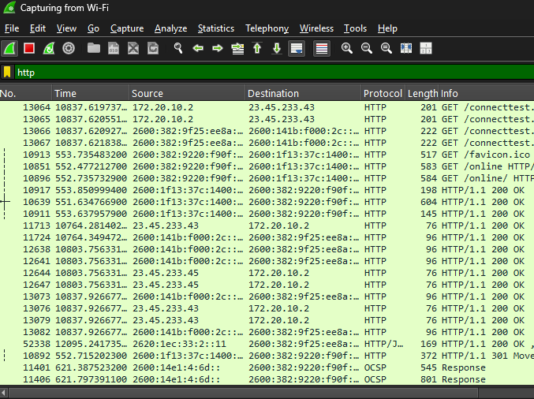
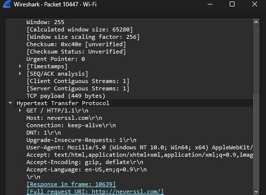
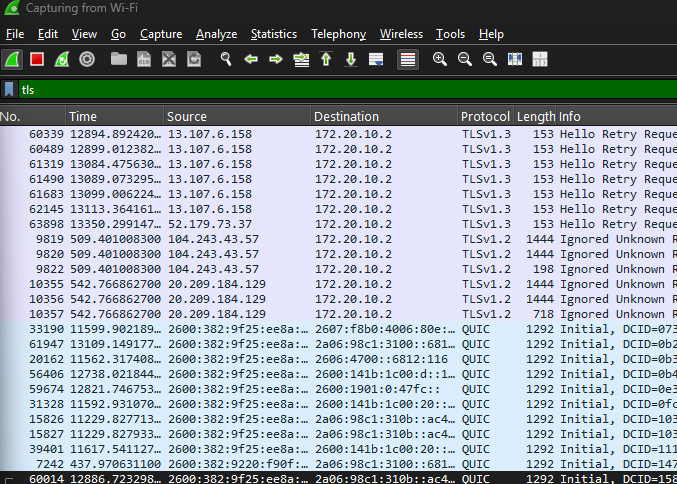
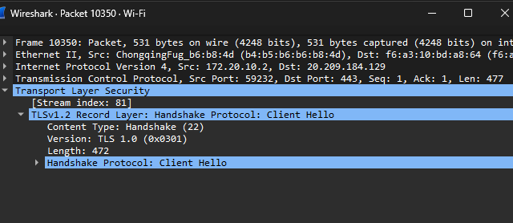

# Wireshark Traffic Analysis

## Objective

To analyze network traffic and understand the difference between HTTP and HTTPS communication.

## Tools Used

* Wireshark

## What I Did

* Captured live network traffic using Wireshark
* Generated HTTP traffic using http://neverssl.com
* Generated HTTPS traffic using a secure website
* Applied filters to isolate HTTP and TLS packets
* Inspected packet contents including GET requests and TLS handshake messages

## Results

### HTTP Traffic

* Observed readable data such as:

  * GET requests
  * Host names (e.g., neverssl.com)
* Demonstrated that HTTP traffic is not encrypted

### HTTPS Traffic (TLS)

* Observed TLS handshake messages such as Client Hello
* Data was not readable due to encryption
* Demonstrated how HTTPS protects communication

## Key Takeaways

* HTTP is insecure because data is transmitted in plain text
* HTTPS uses TLS to encrypt communication
* The TLS handshake establishes a secure connection before data is transmitted
* Network traffic can be analyzed using Wireshark to identify security risks

## Screenshots

